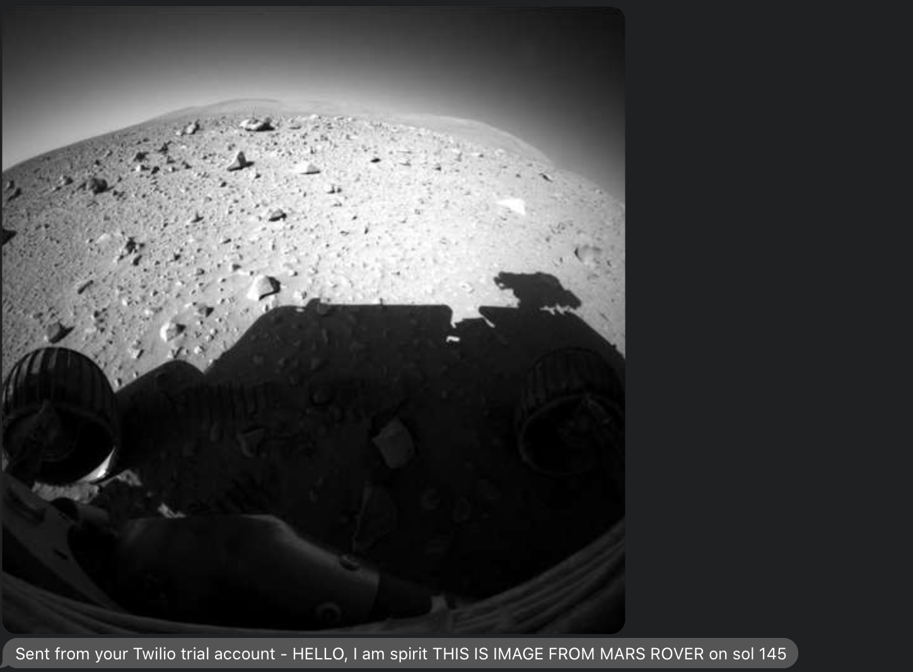

# nasa-mars-rover

#### Mars 2020 mission by NASA's Mars Exploration Program
In honor of the new Mars rover, Perserverance, scheduled to launch on July 17th, 2020 and land on the Jezero crator on February 18th, 2021, I created a small Twilio app.

It is still in progress, as I am trying to figure out how to use the function trigger on Twilio. For now, it is just an sms.js doc where I would have to run on node to activate.

# *How to Run*
Get a Twilio Number

Generate a free NASA Api key

Create your own .env file
- NASA_AUTH=yourapikeyhere
- TWILIO_TOKEN=yourtokenhere
- TWILIO_SID=yourSIDhere
- TWILIO_NUMBER=yourtwilionum
- CELL=+1cellhere
- PORT=3000